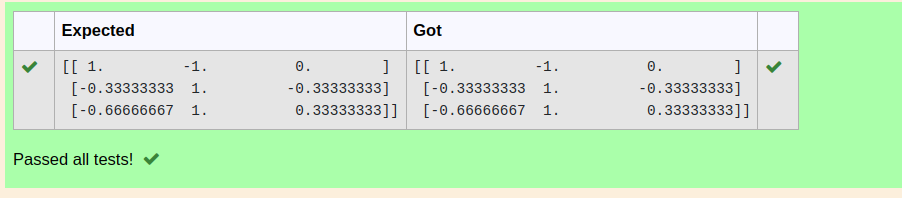

# INVERSE-OF-A-MATRIX

## Aim:
To write a python program to find the inverse of a matrix

## Equipment’s required:
1. 	Hardware – PCs
2. 	Anaconda – Python 3.7 Installation / Moodle-Code Runner

## Algorithm:
### Step1 : 
import numpy as np

### Step 2: 
get the values of matrix

### Step 3: 
get inv(A) by applying np.linalg.inv(A)

### Step 4: 
print the value

## Program:
```
#Program to find the inverse of a matrix.
#Developed by: Praveen D 
#RegisterNumber:212222240076
import numpy as np
A=([[2,1,1],[1,1,1],[1,-1,2]])
inverse=np.linalg.inv(A)
print(inverse)
```
## Output:

## Result:
Thus the inverse of given matrix is successfully solved using python program

